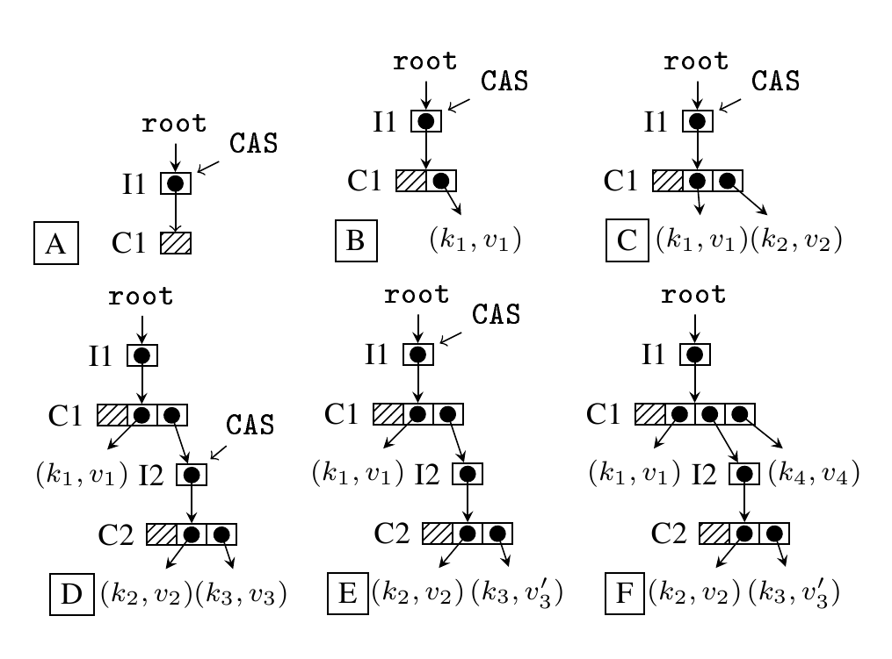

# ctries_go

May grow up to be a Ctries implementation for the Go programming language.

A **concurrent hash-trie** or **Ctrie** is a non-blocking concurrent
shared-memory hash trie based on
[**CAS**](https://en.wikipedia.org/wiki/Compare-and-swap),
the single word compare-and-swap instruction.  CAS is an atomic,
non-interruptable operation; this makes it possible to devise safe
optimistic
algorithms which attempt an operation and then confirm whether it has
succeeded by inspecting the value that the CAS operated on.  If it has
the expected value, the operation succeed; otherwise it failed and so
must be re-tried or abandoned.

The use of the CAS instruction makes it possible to do away with locks,
which require calls to the operating system kernel and so are slow and
inefficient.  In other words, the Ctrie algorithm is **lock-free**,
non-blocking.

A Ctrie consists of a fixed-size set of hash tables, each cell of which
is either null or a pointer to a leaf key-value pair or a pointer to a
**indirection node**.  The tables contain `2^w` entries, where `w` is 5
(for a Ctrie with 32-bit keys) or 6 (for a table with 64-bit keys).

An **indirection node** or **i-node** isolates a table from its parent.
At any given time the i-node points to its current child table.

## Operation

The figure above illustrates the use of the CAS instruction in insert
operations.

If a child table is to be changed, the system constructs a copy of the
child table with any changes to be made.  It then uses CAS to swap the
old to the old child with a pointer to the new child.  If after the
swap the i-node points to the new child, the operation has succeeded.
Otherwise the operation has failed (because some other thread has
successfully updated the i-node to point to an alternate child) and so
the operation must be abandoned or retried.

At `A` in the figure the root's i-node (`I1`) is modified to point to a new
child table, `C1`.  This table is empty.

At `B`, a replica of `C1` is modified to add a pointer to a leaf node
with hash `k1` and value `v1`.  A CAS operation is used to modify the
root i-node to point at the new `C1`; the old version of the table
will need to be garbage-collected.

This process is repeated at C.  A new leaf with key `k2` and value `v2`
is added to a replica of `C1`.  A CAS causes `I1` to point to the new
`C1` and the old `C1` is off for garbage collection.

At `D` there is a hash collision: a new leaf node `<k3, v3>` is to be
added but the first w bits (the prefix) of `k2` and `k3` are the same,
so a candidate i-node `I2` and a new table `C2` are created.  `C2` has
pointers to the old `<k2,v2>` leaf node and the new `<k3, v3>` leaf node.
At `E` a CAS on `I1` switches the second pointer in `C1` to point to `I2`
rather than `<k2,v2>`.  At `F` another leaf entry is added at the top
level, with a CAS on `I1` modifying `C1` to add a pointer to the new
`<k4,v4>` leaf.

Where the tries are larger, concurrent operations on distinct subtrees
will be possible,

## Planned Implementation

Ctries_go will be based on the
[HAMT](https://en.wikipedia.org/wiki/Hash_array_mapped_trie)
data structure.  For a recent implementation
of HAMT in the Go programming language, see
[hamt_go](https://jddixon.github.io/hamt_go).

## References

Prokopec, Bagwell, and Odersky, [Cache-Aware Lock-Free Concurrent Hash Tries](http://infoscience.epfl.ch/record/166908/files/ctries-techreport.pdf),
2011.

## Project Status

A very rough spec and some test code.

## On-line Documentation

More information on the **ctries_go** project can be found
[here](https://jddixon.github.io/ctries_go)
